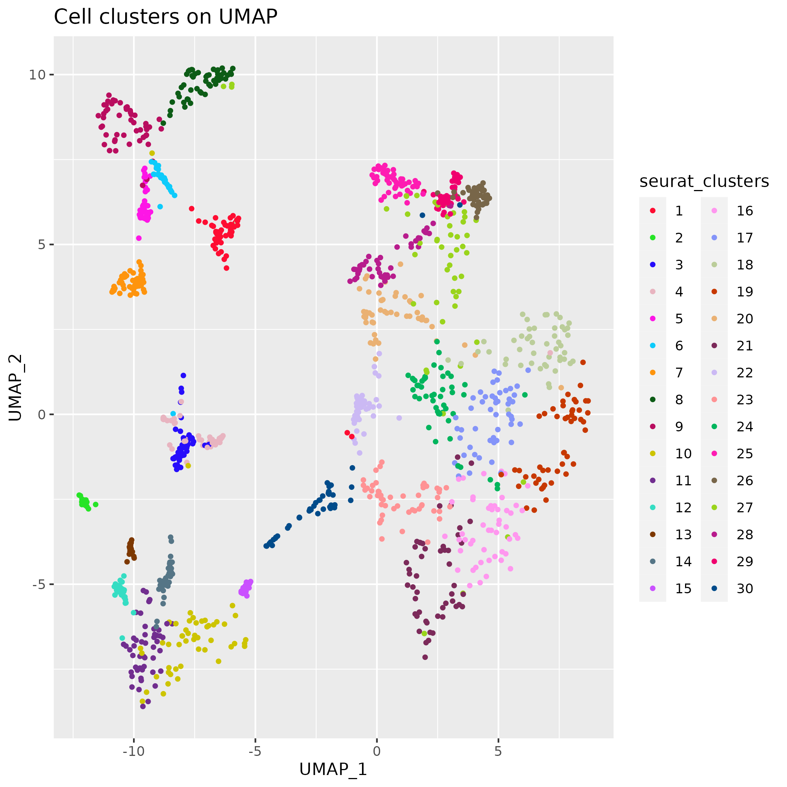
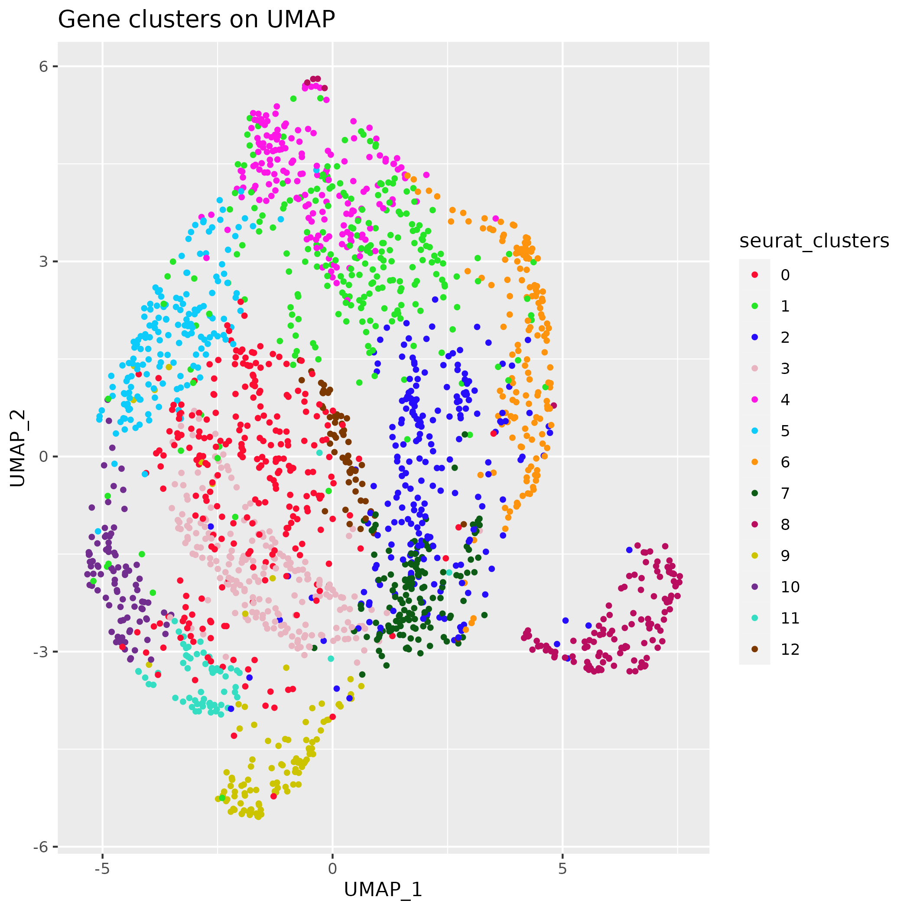
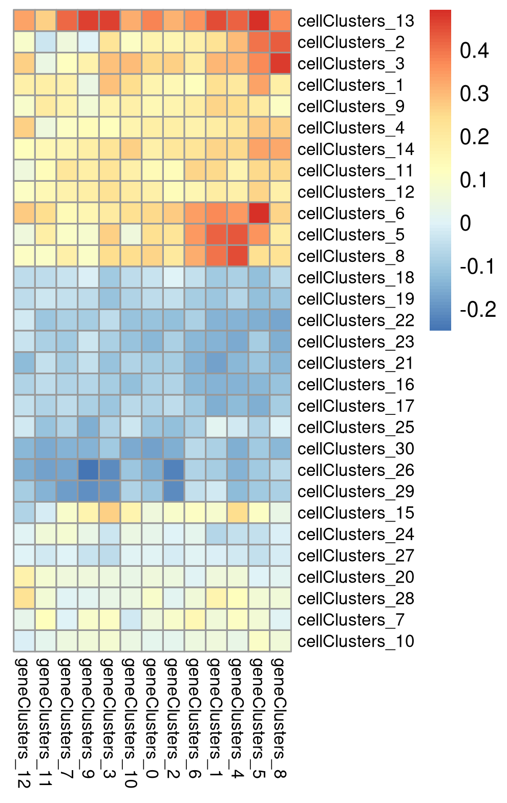
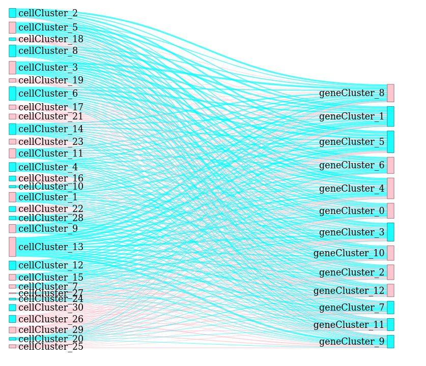
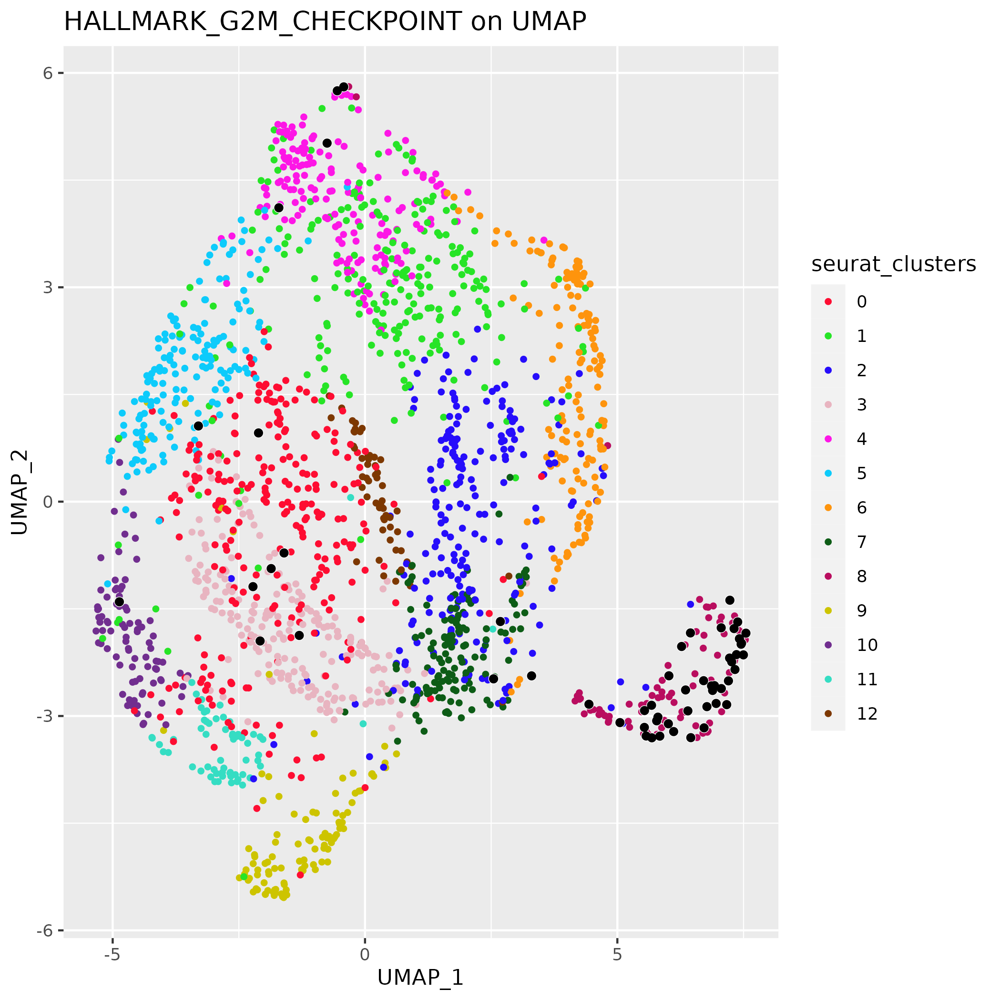
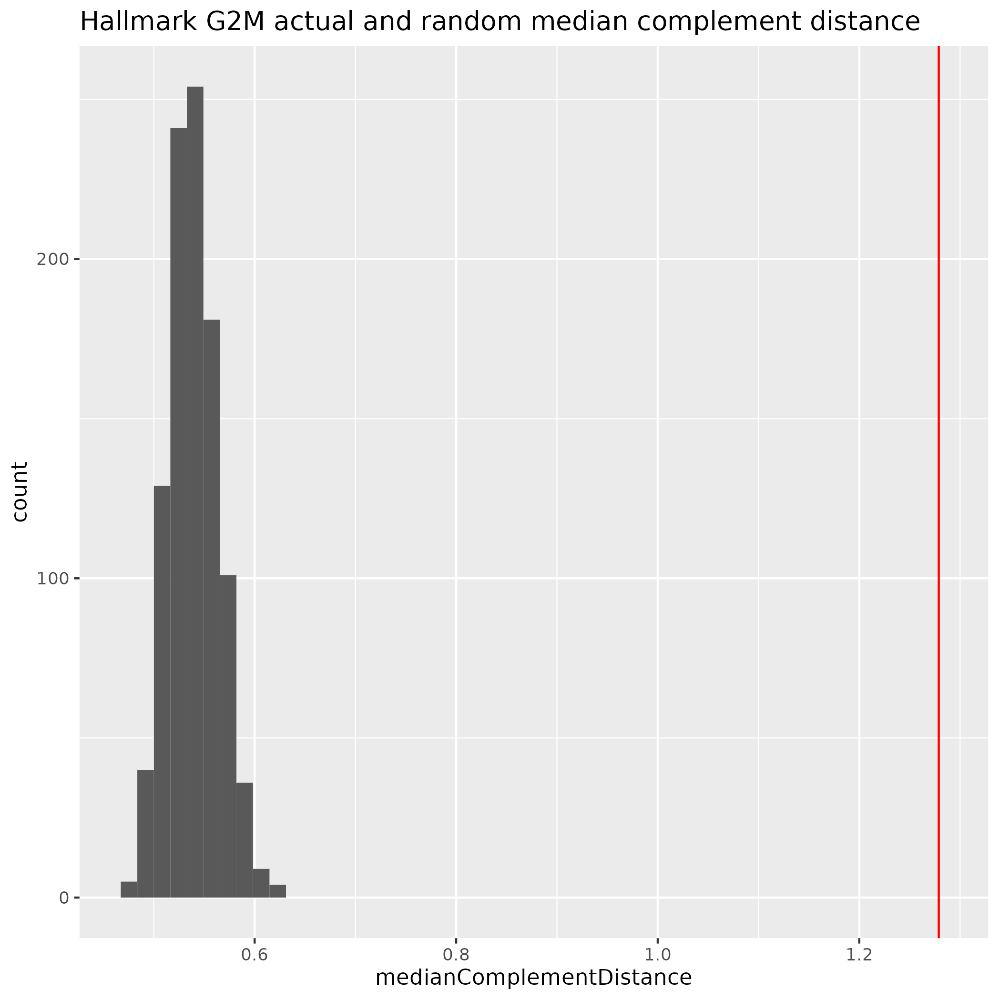
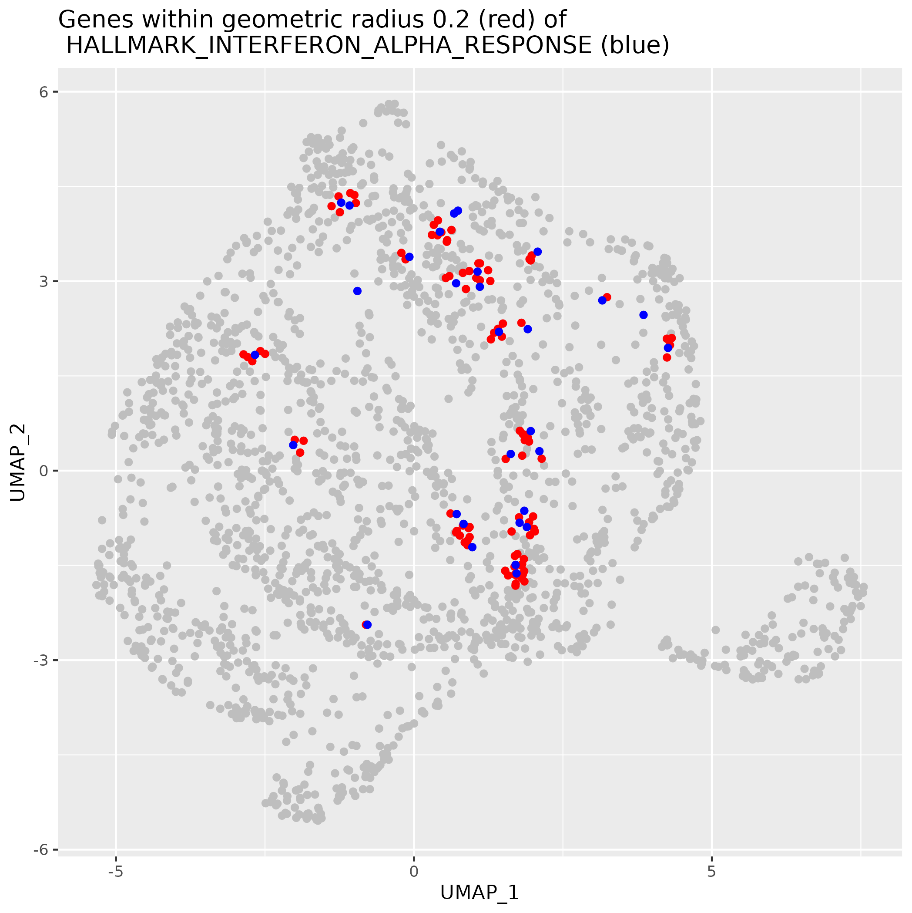

```{r setup, include = FALSE, warning = FALSE}
knitr::opts_chunk$set(
    collapse = TRUE,
    comment = "#>"
)
```

## Introduction

The purpose of this package is to discover and analyse clustering
among genes in single cell RNASeq data.

A typical Seurat single cell analysis starts with an expression matrix
$M$ where the rows represent genes and the columns represent
individual cells.  After normalisation one uses dimension reduction -
PCA, UMAP, tSNE - to produce lower dimensional representations of the
data for the cells and the Louvain algorithm to cluster cells with
similar expression patterns.

CatsCradle operates based on a simple observation: by transposing the
matrix $M$, we can use the same methods to produce lower-dimensional
representations of the genes and cluster the genes into groups that
show similar patterns of expression.

```{r message = FALSE, warning=FALSE, eval=FALSE}
library(CatsCradle)
STranspose = transposeSeuratObject(S)
```
This function transposes the expression matrix and carries out the
basic functions, FindVariableFeatures(), ScaleData(), RunPCA(),
RunUMAP(), FindNeighbors(), and FindClusters().

## Exploring CatsCradle

After transposing the usual Seurat object, the genes are now the
colnames and the individual cells are the rownames.  The Louvain
clustering of the genes is now encoded in
STranspose$seurat_clusters. As with the cells, we can observe these
clusters on UMAP, tSNE or PCA.

{width=6in}

{width=6in}

We have never seen a use case in which there was a reason to query the
identities of the individual cells in a UMAP plot.  However, this
changes with a gene UMAP.  We recommend using plotly to produce a
browseable version of the gene UMAP.  This allows one to hover over
the individual points and discover the genes in each cluster. Typical
code might be

```{r eval = FALSE}
library(plotly)
umap = FetchData(STranspose,c('UMAP_1','UMAP_2','seurat_clusters'))
umap$gene = colnames(STranspose)
plot = ggplot(umap,aes(x=UMAP_1,y=UMAP_2,color=seurat_clusters,label=gene) +
       geom_point()
browseable = ggplotly(plot)
print(browseable)
htmlwidgets::saveWidget(as_widget(browseable),'genesOnUMAP.html')
```

The question arises as to how to annotate the gene clusters.  Assuming
you have working annotations for the cell clusters it can be useful to
examine which cells each of the gene clusters is expressed in.  Here
we give a heatmap of average expression of each gene cluster (columns)
across each cell cluster (rows)

```{r  eval = FALSE}
library(pheatmap)
averageExpMatrix = getAverageExpressionMatrix(S,STranspose)
averageExpMatrix = tagRowAndColNames(averageExpMatrix,
                                     ccTag='cellClusters_',
                                     gcTag='geneClusters_')
pheatmap(averageExpMatrix,
      treeheight_row=0,
      treeheight_col=0,
      fontsize_row=8,
      fontsize_col=8,
      cellheight=10,
      cellwidth=10)
```

{width=6in}

Another way of seeing the relationship between cell clusters and gene
clusters is in a Sankey graph.  This is a bi-partite graph whose
vertices are the cell clusters and the gene clusters.  The edges of
the graph display mean expression as the width of the edge.  One can
either display all edges with edge weight (width) displaying absolute
value and color distinguishing up- and down-regulation of expression
or display separate Sankey graphs for the up- and down-regulated gene
sets.  It is these bi-partite graphs that contribute the name
CatsCradle. Here the up-regulated gene sets are shown in cyan, the
down-regulated sets in pink.  The image was produced with the
following code.

```{r eval = FALSE}
catsCradle =  = sankeyFromMatrix(averageExpMatrix,
                              disambiguation=c('cells_','genes_'),
                              plus='cyan',minus='pink',
                              height=800)
print(catsCradle)
```
The print command opens this in a browser.  This allows one to query
the individual vertices and edges. This can be saved with the
saveWidget command as above.

{width=6in}


## Biologically relevant gene sets on UMAP

Biologically relevant gene sets often cluster on CatsCradle gene
UMAPs.  Here we see a UMAP plot showing the gene clusters (by color),
over-printed with the HALLMARK_G2M_CHECKPOINT that appear in
STranspose in black.  We see that these are strongly associated with
gene cluster 8, but also show "satelite clusters" including an
association with cluster 4 and with the border between clusters 0 and
3.  In our experience, the proliferation gene sets are among the most
strongly clustered.

{width=6in}

## Determining statistical significance of clustering

Given a set of points, $S$ and a non-empty proper subset $X \subset S$
we would like to determine the statistical significance of the degree
to which $X$ is clustered.  To compute this we ask the opposite
question: what do would we see if $X$ were randomly chosen.  In this
case we expect to see $X$ broadly spread out across $S$, i.e., most of
$S$ should be close to a point of $X$.  In particular we expect the
median distance from the complement $S \setminus X$ to $X$ to be low.
Of course, how low, depends on the size of $X$.  Conversely, if the
points of $X$ cluster together, we expect much of $S \setminus X$ to
be further from $X$, at least compared to other sets of the same
size.  We use a distance function inspired by Hausdorf distance. Give
as set $X$, for each $s_k \in S \setminus X$, we take $d_k$ to be the
distance from $s_k$ to the nearest point of $X$. We then take the __median
complement distance__ to be the median of the values $d_k$.  Comparing
this median complement distance for $X \subset S$ with those for
randomly chosen sets $X_i \subset S$ allows us to assess the
clustering of $X$.  (These $X_i$ are chosen to be the same size as
$X$.)
```{r eval = FALSE}
g2mGenes = intersect(colnames(STranspose),
                     hallmark[['HALLMARK_G2M_CHECKPOINT']])
stats = getSubsetClusteringStatistics(STranspose,
                                      g2mGenes,
                                      numTrials=1000)
```				      
This uses UMAP as the default reduction and returns the median
complement distance to the G2M genes in STranspose, and the distances
for 1000 randomly chosen sets of 56 genes.  It computes a p-value
based on the rank of the actual distance among the random distances
and its z-score.  Here we report a p-value of 0.001. However, as can
be seen from the figure, the actual p-value is lower by many orders of
magnitude. 
{width=6in}

## Nearby genes

We have seen that genes with similar annotation have a tendency to
cluster.  This suggests that nearby genes may have similar functions.
To this end, we have supplied a function which finds nearby
genes. This can be done using either PCA, UMAP or tSNE as the
embedding.  Here we find those genes which are within radius 0.2 in UMAP
coordinates of genes in the HALLMARK_INTERFERON_ALPHA_RESPONSE gene
set.
```{r eval = FALSE}
geneSet = intersect(colnames(STranspose),
	            hallmark[['HALLMARK_INTERFERON_ALPHA_RESPONSE']])
nearby = nearbyGenes(STranspose,geneSet,radius=0.2,metric='umap')
```
{width=6in}

## Predicting gene function


