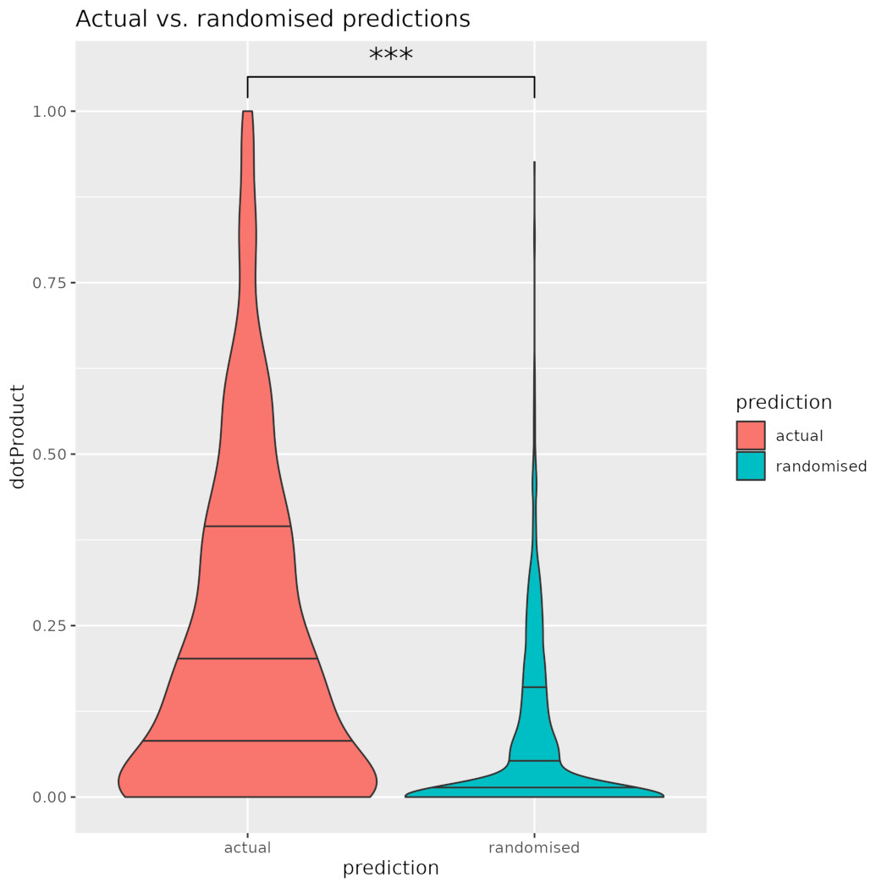

```{r setup, include = FALSE, warning = FALSE}
knitr::opts_chunk$set(
    collapse = TRUE,
    fig.dim=c(6,6),
    comment = "#>"
)
```
`r BiocStyle::Biocpkg("BiocStyle")`

{width=2in}


## Introduction

Here we describe the functionality in this package concerned with
analysing the clustering of genes in single cell RNASeq data.

A typical Seurat single cell analysis starts with an expression matrix
$M$ where the rows represent genes and the columns represent
individual cells.  After normalisation one uses dimension reduction -
PCA, UMAP, tSNE - to produce lower dimensional representations of the
data for the cells and the Louvain algorithm to cluster cells with
similar expression patterns.

CatsCradle operates based on a simple observation: by transposing the
matrix $M$, we can use the same methods to produce lower-dimensional
representations of the genes and cluster the genes into groups that
show similar patterns of expression.

```{r [CC1], message=FALSE}
library(CatsCradle,quietly=TRUE)
getExample = make.getExample()
exSeuratObj = getExample('exSeuratObj')
STranspose = transposeObject(exSeuratObj)
```
This function transposes the expression matrix and carries out the
basic functions, FindVariableFeatures(), ScaleData(), RunPCA(),
RunUMAP(), FindNeighbors(), and FindClusters().

## Exploring CatsCradle

After transposing the usual Seurat object, the genes are now the
columns (samples) and the individual cells are the rows (features).
The Louvain clustering of the genes is now encoded in
STranspose$seurat_clusters. As with the cells, we can observe these
clusters on UMAP, tSNE or PCA.

```{r [CC2], message=FALSE}
library(Seurat,quietly=TRUE)
library(ggplot2,quietly=TRUE)
DimPlot(exSeuratObj,cols='polychrome') + ggtitle('Cell clusters on UMAP')
```

```{r [CC3]}
DimPlot(STranspose,cols='polychrome') + ggtitle('Gene clusters on UMAP')
```


We have never seen a use case in which there was a reason to query the
identities of the individual cells in a UMAP plot.  However, this
changes with a gene UMAP as each gene has a distinct (and interesting)
identity.  We recommend using plotly to produce a browseable version
of the gene UMAP.  This allows one to hover over the individual points
and discover the genes in each cluster. Typical code might be

```{r [CC4], eval = FALSE}
library(plotly,quietly=TRUE)
umap = FetchData(STranspose,c('UMAP_1','UMAP_2','seurat_clusters'))
umap$gene = colnames(STranspose)
plot = ggplot(umap,aes(x=UMAP_1,y=UMAP_2,color=seurat_clusters,label=gene) +
       geom_point()
browseable = ggplotly(plot)
print(browseable)
htmlwidgets::saveWidget(as_widget(browseable),'genesOnUMAP.html')
```

The question arises as to how to annotate the gene clusters.  Assuming
you have working annotations for the cell clusters it can be useful to
examine which cells each of the gene clusters is expressed in.  Here
we give a heatmap of average expression of each gene cluster (columns)
across each cell cluster (rows).

```{r [CC5], message=FALSE}
library(pheatmap,quietly=TRUE)
averageExpMatrix = getAverageExpressionMatrix(exSeuratObj,STranspose,layer='data')
averageExpMatrix = tagRowAndColNames(averageExpMatrix,
                                     ccTag='cellClusters_',
                                     gcTag='geneClusters_')
pheatmap(averageExpMatrix,
      treeheight_row=0,
      treeheight_col=0,
      fontsize_row=8,
      fontsize_col=8,
      cellheight=10,
      cellwidth=10,
      main='Cell clusters vs. Gene clusters')
```


Another way of seeing the relationship between cell clusters and gene
clusters is in a Sankey graph.  This is a bi-partite graph whose
vertices are the cell clusters and the gene clusters.  The edges of
the graph display mean expression as the width of the edge.  One can
either display all edges with edge weight (width) displaying absolute
value and colour distinguishing up- and down-regulation of expression
or display separate Sankey graphs for the up- and down-regulated gene
sets.  It is these bi-partite graphs that contribute the name
CatsCradle. Here the up-regulated gene sets are shown in cyan, the
down-regulated sets in pink.  The image was produced with the
following code.

```{r [CC6], eval = FALSE}
catsCradle = sankeyFromMatrix(averageExpMatrix,
                              disambiguation=c('cells_','genes_'),
                              plus='cyan',minus='pink',
                              height=800)
print(catsCradle)
```
The print command opens this in a browser.  This allows one to query
the individual vertices and edges. This can be saved with the
saveWidget command as above.


## Biologically relevant gene sets on UMAP

Biologically relevant gene sets often cluster on CatsCradle gene
UMAPs.  Here we see a UMAP plot showing the gene clusters (by color),
over-printed with the HALLMARK_G2M_CHECKPOINT that appear in
STranspose in black.  We see that these are strongly associated with
gene cluster 8, but also show "satellite clusters" including an
association with cluster 4 and with the border between clusters 0 and
3.  In our experience, proliferation associated gene sets are among
the most strongly clustered.


```{r [CC7]}
hallmark = getExample('hallmark')
h = 'HALLMARK_G2M_CHECKPOINT'
umap = FetchData(STranspose,c('umap_1','umap_2'))
idx = colnames(STranspose) %in% hallmark[[h]]
g = DimPlot(STranspose,cols='polychrome') +
    geom_point(data=umap[idx,],aes(x=umap_1,y=umap_2),color='black',size=2.7) +
    geom_point(data=umap[idx,],aes(x=umap_1,y=umap_2),color='green') +
    ggtitle(paste(h,'\non gene clusters'))
print(g)
```

## Determining statistical significance of clustering

Given a set of points, $S$ and a non-empty proper subset $X \subset S$
we would like to determine the statistical significance of the degree
to which $X$ is clustered.  To compute this we ask the opposite
question: what would we see if $X$ were randomly chosen?  In this
case we expect to see $X$ broadly spread out across $S$, i.e., most of
$S$ should be close to some point of $X$.  In particular we expect the
median distance from the complement $S \setminus X$ to $X$ to be low.
Of course, how low, depends on the size of $X$.  Conversely, if the
points of $X$ cluster together, we expect much of $S \setminus X$ to
be further from $X$, at least compared to other sets of the same
size.  We use a distance function inspired by Hausdorf distance. Give
a set $X$, for each $s_k \in S \setminus X$, we take $d_k$ to be the
distance from $s_k$ to the nearest point of $X$. We then take the __median
complement distance__ to be the median of the values $d_k$.  Comparing
this median complement distance for $X \subset S$ with those for
randomly chosen sets $X_i \subset S$ allows us to assess the
clustering of $X$.  (These $X_i$ are chosen to be the same size as
$X$.)
```{r [CC8]}
g2mGenes = intersect(colnames(STranspose),
                     hallmark[['HALLMARK_G2M_CHECKPOINT']])
stats = getObjectSubsetClusteringStatistics(STranspose,
                                      g2mGenes,
                                      numTrials=1000)
```				      

This uses UMAP as the default reduction and returns the median
complement distance to the Hallmark G2M genes in STranspose, and the
distances for 1000 randomly chosen sets of 56 genes.  It computes a
p-value based on the rank of the actual distance among the random
distances and its z-score.  Here we report a p-value of
0.001. However, as can be seen from the figure, the actual p-value is
lower by many orders of magnitude.

```{r [CC9]}
statsPlot = ggplot(data.frame(medianComplementDistance=stats$randomSubsetDistance),
                  aes(x=medianComplementDistance)) +
    geom_histogram(bins=50) +
    geom_vline(xintercept=stats$subsetDistance,color='red') +
    ggtitle('Hallmark G2M real and random median complement distance')
print(statsPlot)
```

Here we have shown the statistics for one of the gene sets that is
most tightly clustered on UMAP.  However, of the 50 Hallmark gene
sets 31 cluster with a p-value better than 0.05.

```{r [CC10]}
df = read.table('hallmarkPValues.txt',header=TRUE,sep='\t')
g = ggplot(df,aes(x=logPValue)) +
    geom_histogram() +
    geom_vline(xintercept=-log10(0.05)) +
    ggtitle('Hallmark gene set p-values')
print(g)
```

We have referred to median complement distance p-values as detecting
clustering, but it might be more accurate to describe it as curdling.
That is, it does not detect the tendency of the subset to co-locate in
one region of the superset.  Rather, it detects the tendency of points
in the subset to stick close to each other.  Accordingly, it makes
sense to look at clustering within the subset.  To do this, we analyse
the Delaunay triangulation of the subset within the gene UMAP.  We
then classify the edges in this triangulation into shorter and longer
edges which are assumed to be intra-subcluster and inter-subcluster
edges.  We discard the longer edges and look for the components of the
resulting graph.

```{r [CC10.5]}
h = "HALLMARK_ALLOGRAFT_REJECTION"
theSubset = hallmark[[h]]
theSubset = intersect(theSubset,colnames(STranspose))
alpha = .5
clusters = getSubsetComponents(STranspose,theSubset,alpha)
umap = FetchData(STranspose,c('umap_1','umap_2'))
umap$gene = rownames(umap)
numClusters = length(clusters)
umap$component = 0
for(i in 1:length(clusters))
    umap[clusters[[i]],'component'] = i
umap$component = factor(umap$component)
title = paste(h,'alpha =',alpha)
idx = umap$component != 0
g = ggplot() +
    geom_point(data=umap,aes(x=umap_1,y=umap_2),color='grey') +
    geom_point(data=umap[idx,],aes(x=umap_1,y=umap_2),color='black',size=3.5) +
    geom_point(data=umap[idx,],aes(x=umap_1,y=umap_2,color=component),size=3) +
    ggtitle(title)
print(g)
```

## Gene z-scores on gene UMAP

Here we show that gene UMAP can reveal co-location of the genes that
are up-regulated in each cell cluster.  To do this, we start by
finding the z-score for expression of each gene computed across all
cells.  For each gene in the gene Seurat object, and each cell cluster
in the cell Seurat object, we then compute the mean z-score for that
gene in the cells of that cluster.  Plot this on the gene umap reveals
localised patterns of gene expression.  Creating a browseable figure
allows for easy querying of the up-regulated genes.

```{r [CC11]}
meanZDF	 = meanZPerClusterOnUMAP(exSeuratObj,
                                 STranspose,
	                         'shortName')


h = ggplot(meanZDF,aes(x=umap_1,y=umap_2,color=EntericGliaCells)) +
    geom_point() +
    scale_color_gradient(low='green',high='red') +
    ggtitle('Mean z-score, Enteric glia on gene UMAP')
print(h)
```

P-values for the spatial autocorrelation of these values can be found
using runMoransI().  

In the case where there are multiple clusters of similar cells,
plotting the difference in mean z-score can illuminate the differences
in the sub-clusters.  Here we plot the difference in z-score between
TCells3 and TCells1.

```{r [CC12]}
TDiff = meanZDF[,1:3]
TDiff$TDiff = meanZDF$TCells3 - meanZDF$TCells1
k = ggplot(TDiff,aes(x=umap_1,y=umap_2,color=TDiff)) +
    geom_point() +
    scale_color_gradient(low='green',high='red') +
    ggtitle('Mean z-score, TCells3 - TCells1')
print(k)
```


## Nearby genes

We have seen that genes with similar annotation have a tendency to
cluster.  This suggests that nearby genes may have similar functions.
To this end, we have supplied a function which finds nearby
genes. This can be done geometrically using either PCA, UMAP or tSNE
as the embedding or combinatorially using the nearest neighbor graph.
The function returns a named vector whose values are the distances
from the gene set and whose names are the genes. Here we find those
genes which are within radius 0.2 in UMAP coordinates of genes in the
HALLMARK_INTERFERON_ALPHA_RESPONSE gene set.  As you can see, the
combinatorial radius of a gene set can grow quite quickly and need not
have a close relation to UMAP distance. This function will also return
weighted combinatorial distance from a single gene where distance is
the reciprocal of edge weight.

```{r [CC13]}
geneSet = intersect(colnames(STranspose),
                    hallmark[['HALLMARK_INTERFERON_ALPHA_RESPONSE']])
geometricallyNearbyGenes = getNearbyGenes(STranspose,geneSet,radius=0.2,metric='umap')
theGeometricGenesThemselves = names(geometricallyNearbyGenes)
combinatoriallyNearbyGenes = getNearbyGenes(STranspose,geneSet,radius=1,metric='NN')
theCombinatoricGenesThemselves = names(combinatoriallyNearbyGenes)
df = FetchData(STranspose,c('umap_1','umap_2'))
df$gene = colnames(STranspose)
geneSetIdx = df$gene %in% geneSet
nearbyIdx = df$gene %in% theGeometricGenesThemselves
g = ggplot() +
    geom_point(data=df,aes(x=umap_1,y=umap_2),color='gray') +
    geom_point(data=df[geneSetIdx,],aes(x=umap_1,y=umap_2),color='blue') +
    geom_point(data=df[nearbyIdx,],aes(x=umap_1,y=umap_2),color='red') +
    ggtitle(paste0('Genes within geometric radius 0.2 (red) of \n',
                     'HALLMARK_INTERFERON_ALPHA_RESPONSE (blue)'))
print(g)
```


## Predicting gene function

Given a particular gene, it is interesting to look at the annotations
of nearby genes in the gene Seurat object.  In this context,
"annotations" might mean GO or Hallmark, "nearby" might mean in terms
of UMAP or PCA coordinates or in the nearest neighbour graph in the
gene Seurat object.  Here we will look at Hallmark annotations and
UMAP coordinates.

Gene annotation lists give lists of genes.  For each gene, we can
collect the annotations is belongs to.  The function annotateGenesByGeneSet()
inverts the gene sets to give a list of the sets each gene belongs
to. 

```{r [CC14]}
annotatedGenes = annotateGenesByGeneSet(hallmark)
names(annotatedGenes[['Myc']])
```
We see that Myc belongs to ten hallmark sets.  We can also give the
annotations of a gene as a vector.

```{r [CC15]}
 Myc = annotateGeneAsVector('Myc',hallmark)
 MycNormalised = annotateGeneAsVector('Myc',hallmark,TRUE)
```
These are named vectors whose names are the Hallmark sets. Myc is a
 0-1 vector indicating membership.  MycNormalised gives these values
 normalised by the size of the sets in question.  This is appropriate
 when we wish to weight the contributions of nearby genes as they are
 more likely to belong to larger gene sets.

```{r [CC16]}
predicted = predictAnnotation('Myc',hallmark,STranspose,radius=.5)
predicted$Myc[1:10]
```

predictAnnotation() accepts a vector of genes and returns a list of
prediction vectors.  Here we have given it a single gene, Myc, and we
see that it has predicted one of the gene sets listed for Myc.

Predictions made in this manner perform well above chance. Of the 2000
genes in STranspose, 922 have the property that they appear in at
least one of the Hallmark gene sets and at least one of their nearby
genes appears in a Hallmark gene set.  This means that we are able to
compare their actual annotation vectors with their predicted
annotation vectors.  After normalising both to unit vectors, we can
take their dot prodcts as a measure of their closeness.  Comparing the
actual dot products for these 922 genes to those produced by 1000
randomised predictions produces the following comparison.

{width=6in}


```{r [CC17]}
sessionInfo()
```


